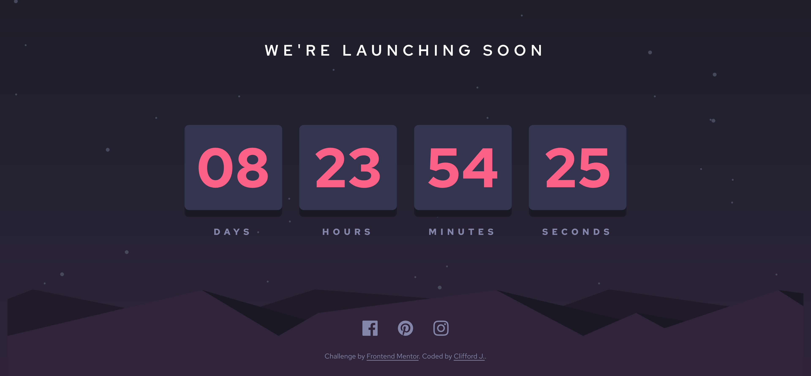
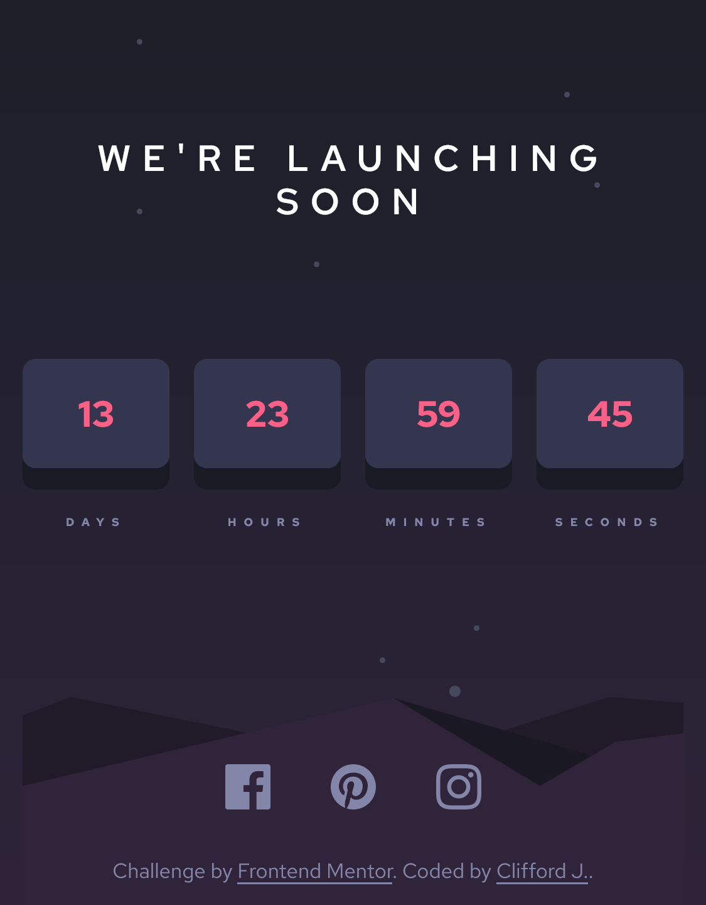

# Frontend Mentor - Launch countdown timer solution

This is a solution to the [Launch countdown timer challenge on Frontend Mentor](https://www.frontendmentor.io/challenges/launch-countdown-timer-N0XkGfyz-).

## Table of contents

- [Overview](#overview)
  - [The challenge](#the-challenge)
  - [Screenshot](#screenshot)
  - [Links](#links)
- [My process](#my-process)
  - [Built with](#built-with)
  - [Continued development](#continued-development)
  - [Pending](#Pending)
- [Author](#author)

## Overview

### The challenge

Users should be able to:

- See hover states for all interactive elements on the page
- See a live countdown timer that ticks down every second (start the count at 14 days)
- **Bonus**: When a number changes, make the card flip from the middle

### Screenshot

### Links

- Live Site URL: [URL](https://launch-countdown-timer-main-cliffordjfedev.vercel.app/)

## My process

### Built with

- Semantic HTML5 markup
- CSS custom properties
- Flexbox
- Bootstrap v5.1

### Continued development

I have to keep practicing CSS grid, my programming logic, CSS tricks like flip a card to be able to improve my skills.

## Author
- Frontend Mentor - [@cliffordjfedev](https://www.frontendmentor.io/profile/cliffordjfedev)

## Pending

- When a number changes, make the card flip from the middle.

